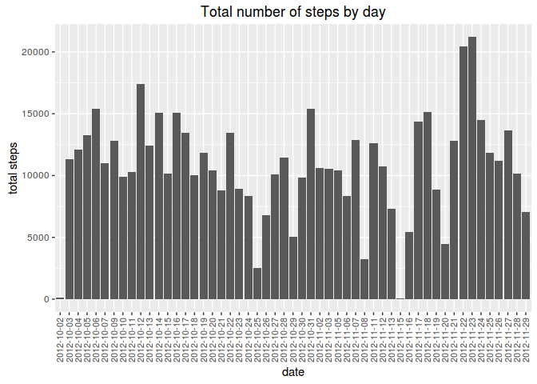
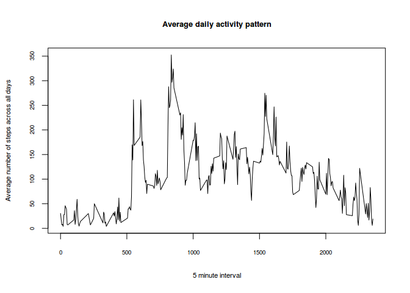
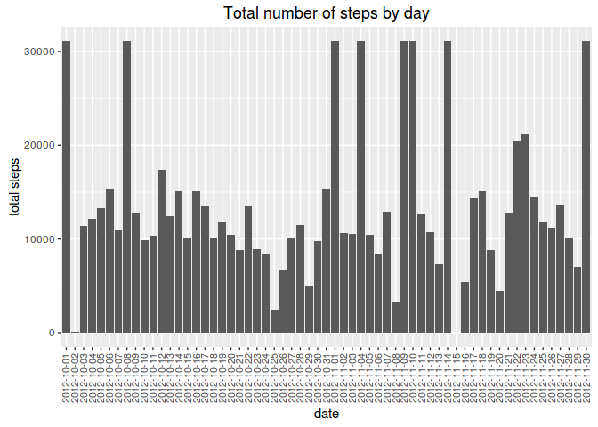
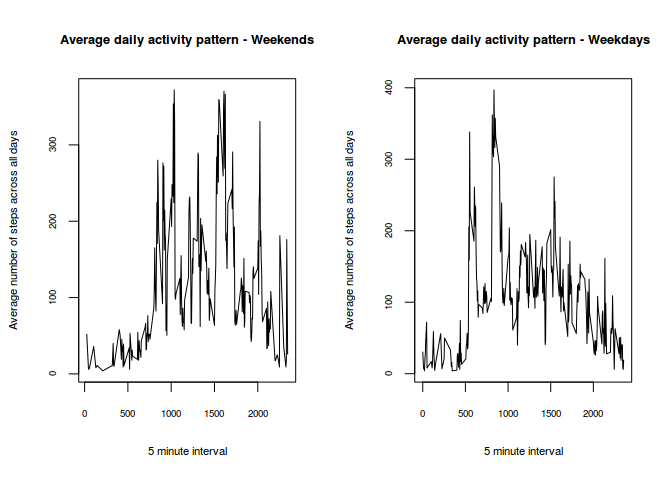

# Report - Reproducible Research - Course Project 01
Leonardo R Alves  
February 6, 2016  
#Instructions

##Introduction

It is now possible to collect a large amount of data about personal movement using activity monitoring devices such as a Fitbit, Nike Fuelband, or Jawbone Up. These type of devices are part of the “quantified self” movement – a group of enthusiasts who take measurements about themselves regularly to improve their health, to find patterns in their behavior, or because they are tech geeks. But these data remain under-utilized both because the raw data are hard to obtain and there is a lack of statistical methods and software for processing and interpreting the data.

This assignment makes use of data from a personal activity monitoring device. This device collects data at 5 minute intervals through out the day. The data consists of two months of data from an anonymous individual collected during the months of October and November, 2012 and include the number of steps taken in 5 minute intervals each day.

The data for this assignment can be downloaded from the course web site:

    Dataset: Activity monitoring data [52K]

The variables included in this dataset are:

    steps: Number of steps taking in a 5-minute interval (missing values are coded as NA)
    date: The date on which the measurement was taken in YYYY-MM-DD format
    interval: Identifier for the 5-minute interval in which measurement was taken

The dataset is stored in a comma-separated-value (CSV) file and there are a total of 17,568 observations in this dataset. 

##1. Loading and preprocessing the data


```r
#Importing the dataset
#First you need to setwd (setting working directory)
fileUrl <- "https://d396qusza40orc.cloudfront.net/repdata%2Fdata%2Factivity.zip"
download.file(fileUrl,destfile="./activity_monitoring_data.zip",method="curl")
unzip("activity_monitoring_data.zip")
# Loading dataset
activity <- read.csv("activity.csv")
#
```

##2. What is mean total number of steps taken per day?

For this part of the assignment, you can ignore the missing values in the dataset.

    - 2.1 Calculate the total number of steps taken per day
    - 2.2 If you do not understand the difference between a histogram and a barplot, research the difference between them. Make a histogram of the total number of steps taken each day
    - 2.3 Calculate and report the mean and median of the total number of steps taken per day

```r
library(dplyr)
```

```
## 
## Attaching package: 'dplyr'
## 
## The following objects are masked from 'package:stats':
## 
##     filter, lag
## 
## The following objects are masked from 'package:base':
## 
##     intersect, setdiff, setequal, union
```

```r
library(ggplot2)
```

###2.1 Calculate the total number of steps taken per day

```r
## Calculating the total number of steps taken per day and storing in a data.frame
days <- group_by(activity, date)
total_steps <- as.data.frame(summarize(days, total = sum(steps, na.rm = TRUE)))
## Considering only days with total steps greater than 0
total_steps_final <- as.data.frame(filter(total_steps, total > 0))
```

###2.2 Make a histogram of the total number of steps taken each day


```r
## histogram of the total number of steps taken each day
ggplot(total_steps_final,aes(x=date,y=total))+ ggtitle("Total number of steps by day") + ylab("total steps") + geom_bar(stat="identity") + theme(axis.text.x = element_text(angle=90, vjust=0.5, size=8))
```

 

###2.3 Calculate and report the mean and median of the total number of steps taken per day

```r
mean(total_steps_final$total)
```

```
## [1] 10766.19
```

```r
median(total_steps_final$total)
```

```
## [1] 10765
```

```r
## answer 10766,19 and 10765 steps by day respectively
```

##3. What is the average daily activity pattern?

    - 3.1 Make a time series plot (i.e. type = "l") of the 5-minute interval (x-axis) and the average number of steps taken, averaged across all days (y-axis)
    - 3.2 Which 5-minute interval, on average across all the days in the dataset, contains the maximum number of steps?

###3.1 Make a time series plot (i.e. type = "l") of the 5-minute interval (x-axis) and the average number of steps taken, averaged across all days (y-axis)

```r
##Time series plot of the average number of steps taken
ts.activity <- activity[complete.cases(activity),] ## removing Nas
ts.activity <- filter(ts.activity, steps > 0) ## removing 0 values
interval <- group_by(ts.activity, interval)
mean_interval<-as.data.frame(summarize(interval, interval_mean = mean(steps, na.rm = TRUE)))
plot(mean_interval, cex.axis = 0.6, cex.main = 0.8, cex.sub = 0.7, cex.lab = 0.7, main = "Average daily activity pattern", xlab = "5 minute interval", ylab = "Average number of steps across all days", type = "l")
```

 

###3.2 Which 5-minute interval, on average across all the days in the dataset, contains the maximum number of steps?

```r
max_avgsteps <- mean_interval[order(mean_interval$interval_mean, decreasing = TRUE),]
max_avgsteps[1,1]
```

```
## [1] 835
```

```r
## answer: 835 minute interval
```

##4. Imputing missing values

Note that there are a number of days/intervals where there are missing values (coded as NA). The presence of missing days may introduce bias into some calculations or summaries of the data.

    -4.1 Calculate and report the total number of missing values in the dataset (i.e. the total number of rows with NAs)
    -4.2 Devise a strategy for filling in all of the missing values in the dataset. The strategy does not need to be sophisticated. For example, you could use the mean/median for that day, or the mean for that 5-minute interval, etc.
    -4.3 Create a new dataset that is equal to the original dataset but with the missing data filled in.
    -4.4 Make a histogram of the total number of steps taken each day and Calculate and report the mean and median total number of steps taken per day. Do these values differ from the estimates from the first part of the assignment? What is the impact of imputing missing data on the estimates of the total daily number of steps?

###4.1 Calculate and report the total number of missing values in the dataset (i.e. the total number of rows with NAs)

```r
## Calculate and report the total number of missing values in the dataset (i.e. the total number of rows with NAs)
sum(is.na(activity))
```

```
## [1] 2304
```

```r
## answer: 2304 missing values
```

###4.2 Devise a strategy for filling in all of the missing values in the dataset.

```r
## Devise a strategy for filling in all of the missing values in the dataset. The strategy does not need to be sophisticated.
mean_avgsteps <- mean(mean_interval$interval_mean)## overall mean steps of intervals
rep_activity <- activity
rep_activity <- as.data.frame(activity$steps)
impute.mean <- function(x) replace(x, is.na(x), mean_avgsteps)
rep_activity_wnas <- impute.mean(rep_activity)
```

###4.3 Create a new dataset that is equal to the original dataset but with the missing data filled in

```r
##new dataset that is equal to the original dataset but with the missing data filled in a new column "activity$steps"
activity_new <- cbind(activity, rep_activity_wnas)
names(activity_new)<-c("steps", "date", "interval", "steps_new")
```

###4.4 Make a histogram of the total number of steps taken each day and Calculate and report the mean and median total number of steps taken per day

```r
##Make a histogram of the total number of steps taken each day and Calculate and report the mean and median total number of steps taken per day. Do these values differ from the estimates from the first part of the assignment? What is the impact of imputing missing data on the estimates of the total daily number of steps?

days2 <- group_by(activity_new, date)
total_steps2 <- as.data.frame(summarize(days2, total = sum(steps_new, na.rm = TRUE)))
## Considering only days with total steps greater than 0
total_steps_final2 <- as.data.frame(filter(total_steps2, total > 0))
## histogram of the total number of steps taken each day
ggplot(total_steps_final2,aes(x=date,y=total))+ ggtitle("Total number of steps by day") + ylab("total steps") + geom_bar(stat="identity") + theme(axis.text.x = element_text(angle=90, vjust=0.5, size=8))
```

 

```r
## Mean and median number of steps taken each day
mean(total_steps_final2$total)
```

```
## [1] 13431.61
```

```r
median(total_steps_final2$total)
```

```
## [1] 11458
```

```r
##answer 13431.61 and 11458 steps respectively
```
###Do these values differ from the estimates from the first part of the assignment? What is the impact of imputing missing data on the estimates of the total daily number of steps?
Answer: Yes, these values differ from the estimates from the first part of the assignment (10766,19 (mean) and 10765(median) steps by day respectively for the first part of assignment versus 13431.61 (mean) and 11458 (median) steps respectively with the impact of imputing missing data as overall mean steps of intervals). These values considering missing data are greater than not considering.

##5. Are there differences in activity patterns between weekdays and weekends?
for this part the weekdays() function may be of some help here. Use the dataset with the filled-in missing values for this part.

    -5.1 Create a new factor variable in the dataset with two levels – “weekday” and “weekend” indicating whether a given date is a weekday or weekend day.
    -5.2 Make a panel plot containing a time series plot (i.e. type = "l") of the 5-minute interval (x-axis) and the average number of steps taken, averaged across all weekday days or weekend days (y-axis).

###5.1 Create a new factor variable in the dataset with two levels – “weekday” and “weekend” indicating whether a given date is a weekday or weekend day.

```r
## Create a new factor variable in the dataset with two levels – “weekday” and “weekend” indicating whether a given date is a weekday or weekend day.
library(timeDate)
data_week <- activity
week <- vector(mode="character", length=17568)
aux <- 0
for (i in 1:17568){
aux <- isWeekday(data_week$date[i])
if (aux == TRUE){ 
  week[i]<-c("weekday")
} else{
    week[i]<-c("weekend")
  }
}
activity_week<-cbind(data_week, as.factor(week))
names(activity_week) <- c("steps","date","interval", "week")
```

###5.2 Make a panel plot containing a time series plot (i.e. type = "l") of the 5-minute interval (x-axis) and the average number of steps taken, averaged across all weekday days or weekend days (y-axis).

```r
##Make a panel plot containing a time series plot (i.e. type = "l") of the 5-minute interval (x-axis) and the average number of steps taken, averaged across all weekday days or weekend days (y-axis).
library(dplyr)
ts.activity2 <- activity_week[complete.cases(activity_week),] ## removing Nas
ts.activity2 <- filter(ts.activity2, steps > 0) ## removing 0 values
interval2 <- group_by(ts.activity2, interval)
interval2 <- as.data.frame(interval2)
interval2_weekdays <- filter(interval2, week=="weekday")
interval2_weekdays <- group_by(interval2_weekdays, interval)
interval2_weekends <- filter(interval2, week=="weekend")
interval2_weekends <- group_by(interval2_weekends, interval)
mean_interval2_weekdays<-as.data.frame(summarize(interval2_weekdays, mean_steps = mean(steps, na.rm = TRUE)))
mean_interval2_weekends<-as.data.frame(summarize(interval2_weekends, mean_steps = mean(steps, na.rm = TRUE)))
par(mfrow = c(1,2))
plot(mean_interval2_weekends,cex.axis = 0.6, cex.main = 0.8, cex.sub = 0.7, cex.lab = 0.7, main = "Average daily activity pattern - Weekends", xlab = "5 minute interval", ylab = "Average number of steps across all days", type = "l")
plot(mean_interval2_weekdays,cex.axis = 0.6, cex.main = 0.8, cex.sub = 0.7, cex.lab = 0.7, main = "Average daily activity pattern - Weekdays", xlab = "5 minute interval", ylab = "Average number of steps across all days", type = "l")
```

 
